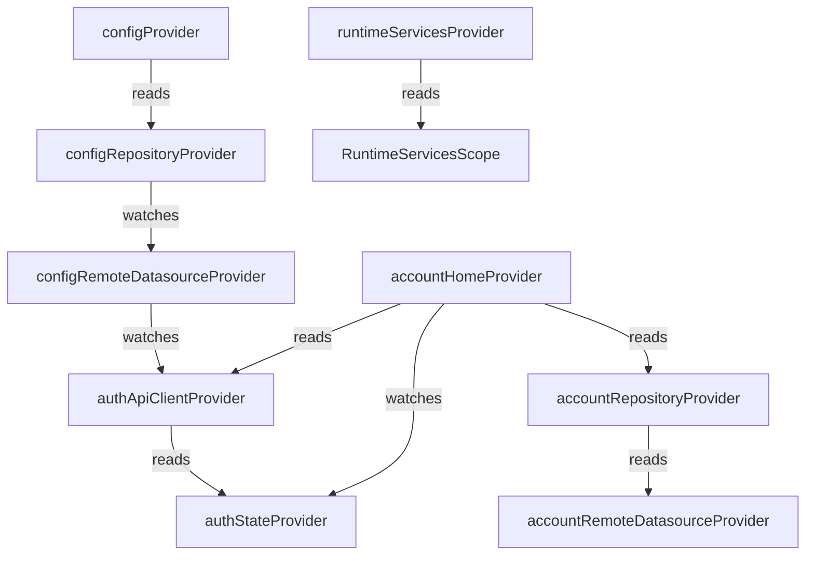

# PROVIDER AUDIT REPORT

This audit maps the Riverpod state management providers and evaluates the dependency graph.

## 1. Provider Dependency Graph
The dependencies between Riverpod providers are mapped as follows:



## 2. Dependency Loop Risks
- **No Static Dependency Loops**: No providers watch each other in a circular structure.
- **Runtime Dependency Loop**: `authApiClientProvider` reads `authStateProvider` dynamically inside its `InterceptorsWrapper.onRequest` interceptor:
  ```dart
  final authState = ref.read(authStateProvider);
  ```
  Since this is inside a deferred network call callback rather than the provider initialization body, it does not trigger a Riverpod circular dependency crash at startup. However, if `verifySessionWithDatabase()` in `authStateProvider` triggers a request via `authApiClientProvider` that throws a 401/403, and the interceptor triggers a logout which resets `authStateProvider`, it previously caused a stack overflow/infinite loop. This is now mitigated by the `_verifyAttempts` counter limit in [auth_state_provider.dart](file:///home/londo/nurisk/mobile/app/lib/features/auth/presentation/notifiers/auth_state_provider.dart).

## 3. Silent Failures and Loading-Forever Bugs
- **`configProvider`**:
  If the BFF call fails, `ConfigRepositoryImpl` falls back to `localDatasource.getCachedConfig()`. Because `localDatasource` always returns `_defaultConfig` on cache miss, `configProvider` transitions to `AsyncData` containing empty widgets instead of `AsyncError`. This causes a silent success state where the dashboard appears blank without showing any error or retry options.
- **`accountHomeProvider`**:
  If the user is authenticated and the BFF call to `account/home` fails, `accountHomeProvider` will correctly enter `AsyncError` state. The UI displays the error screen and enables the user to retry via the "Coba Lagi" button.
- **`remoteNodeProvider`**:
  If a remote SDUI node fails to load, the provider enters `AsyncError`. The component renders a red error text and does not hang in a loading state.
