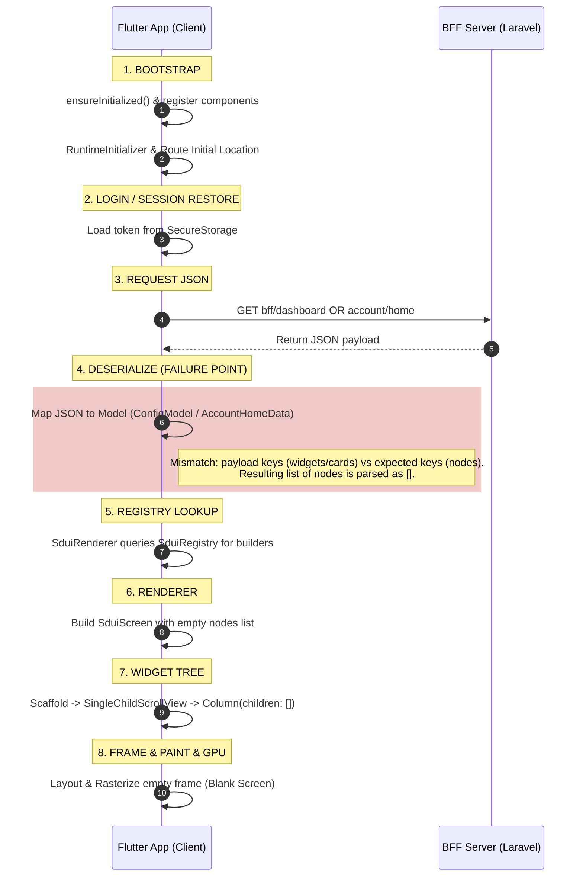

# SDUI LIFECYCLE REPORT

## 1. SDUI Lifecycle Flow
Below is the sequential call graph of the SDUI lifecycle in the NURISK application:

## 2. Point of Failure
The chain breaks at **Step 4: Deserialize**. 
The response JSON from the server and the parser models on the client have misaligned contracts:
- **Public Dashboard**: The server sends widgets under `data.widgets`, while the parser reads the top-level root for `nodes`. This results in `widgets = []` inside `ConfigModel`.
- **Account / Command Center**: The server wraps the SDUI response in a `cards` sub-object, whereas the datasource passes the top-level `data` map to the `AccountHomeData.fromJson` parser which looks for `nodes` at the root. This results in `nodes = []` inside `AccountHomeData`.

Because the list of nodes evaluates to `[]`, the renderer generates a `Column` with `children: []`. The UI successfully renders a valid but empty layout, showing a blank white/dark screen underneath the App Bar.
