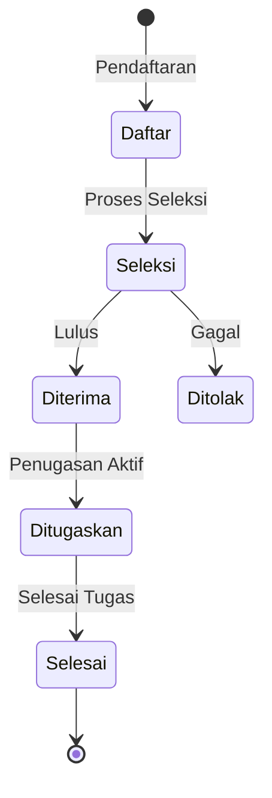

# VOLUNTEER_DOMAIN_AUDIT

## Domain B — Volunteer Lifecycle

### 1. Proses Lifecycle Relawan
- **Pendaftaran**: Tersimpan di tabel `relawan_pendaftaran`.
- **Verifikasi**: Melibatkan field `id_verifikator` dan `waktu_verifikasi`.
- **Aktivasi**: Relawan dianggap aktif jika `status_pendaftaran` menjadi `diterima` atau `ditugaskan`.
- **Penugasan**: Tercatat di tabel `relawan_penugasan`.
- **Nonaktif**: Tabel `relawan_penugasan` memiliki `status_aktif` = false.

### 2. Diagram Volunteer Lifecycle

### 3. Verifikasi Status Relawan
Berdasarkan pengecekan field enum pada tabel relawan:
- `REGISTERED` — **PARTIAL** (Ada `dibuka`)
- `VERIFIED` — **PARTIAL** (Ada `diterima`)
- `ACTIVE` — **PARTIAL** (Ada status `status_aktif` boolean)
- `AVAILABLE` — **MISSING**
- `ON_ASSIGNMENT` — **IMPLEMENTED** (Ada `ditugaskan`)
- `OFF_DUTY` — **PARTIAL** (Ada `selesai`)
- `SICK` — **MISSING**
- `INACTIVE` — **MISSING**
- `ARCHIVED` — **MISSING**

---

## Domain C — Volunteer Profile Integrity

Berdasarkan tabel `auth_pengguna_profil` dan `auth_users`:
- **Nama**: **IMPLEMENTED** (`nama_lengkap`)
- **NIK**: **IMPLEMENTED** (`nik`)
- **Nomor HP**: **IMPLEMENTED** (`no_hp` di `auth_users`)
- **Alamat**: **PARTIAL** (Hanya `id_desa_domisili`, alamat detail string hilang)
- **Wilayah**: **IMPLEMENTED**
- **Jenis Kelamin**: **MISSING** (GAP)
- **Tanggal Lahir**: **MISSING** (GAP)
- **Golongan Darah**: **MISSING** (GAP)
- **Kontak Darurat**: **MISSING** (GAP)
- **Foto**: **MISSING** (GAP)
- **Status Aktif**: **IMPLEMENTED** (`status_akun` dan `is_tersedia`)

---

## Domain D — Competency System

Struktur saat ini:
- `auth_keahlian_master` (Tersedia)
- `auth_pengguna_keahlian` (Tersedia)

**Kemampuan Pencarian:**
Sistem dapat mencari relawan berdasarkan keahlian dasar.
Namun, `master_sertifikasi` dan `relawan_sertifikasi` ekuivalen adalah **MISSING**. Tidak ada hierarki kompetensi (misal: "Tenaga Medis Bersertifikat vs Basic").

**Kesimpulan Gap:** **GAP KRITIS** pada sistem sertifikasi kompetensi.
