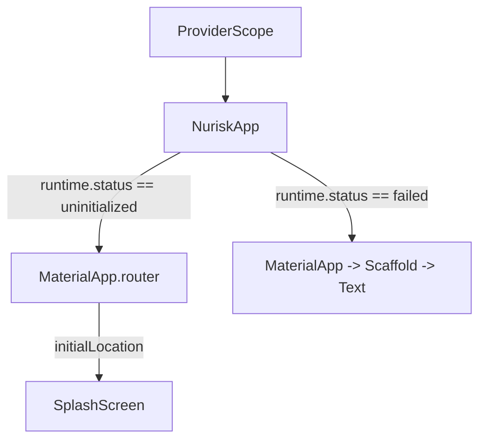
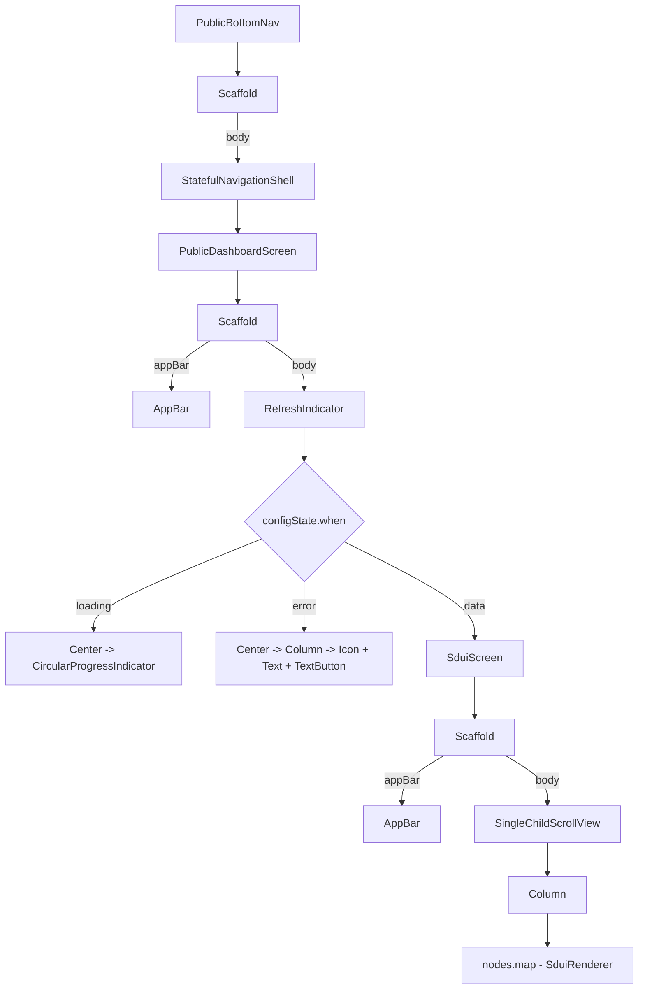
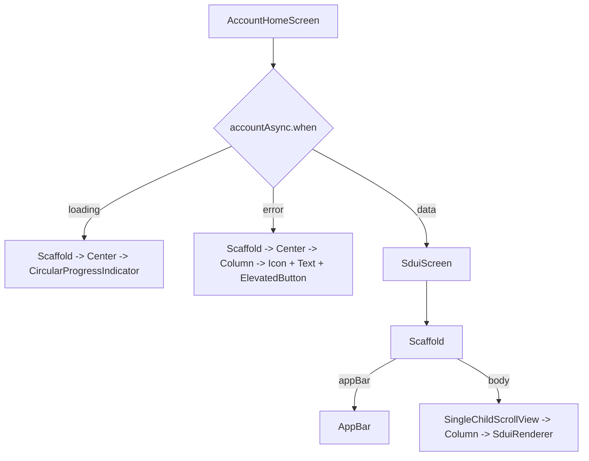

# WIDGET TREE AUDIT REPORT

## 1. Top-Level Hierarchy

## 2. Navigation Target Paths (Route Tracing)
Upon splash duration expiry (~1500ms) and authentication status loaded:
- **Guest / Authenticated User**: Navigates to `/p/home`.
- **Route Matches**:
  - `StatefulShellRoute.indexedStack` builds `PublicBottomNav(navigationShell)`.
  - The default active branch is `home` (`/p/home`), which mounts `PublicDashboardScreen`.

## 3. Public Dashboard Screen Widget Subtree

## 4. Account Screen Widget Subtree (Profile Tab)
When user switches to the 'Akun' (Profile) tab `/p/profile`:

## 5. Terminal Widget Before WSOD / Blank Rendering
- On both the Dashboard (`/p/home`) and Account (`/p/profile`) screens, the final rendered widget in the subtree is `SduiScreen`'s `SingleChildScrollView -> Column`.
- Due to JSON contract mapping mismatches between the BFF responses and the client's models:
  - Dashboard: `nodes` is parsed as `[]` because the BFF returns `widgets` under `data`, but client expects `nodes` under top-level root.
  - Account: `nodes` is parsed as `[]` because the BFF returns `cards` containing `nodes`, but client expects `nodes` directly inside `data`.
- Since `nodes` is `[]`, the `Column` has 0 children. The screen below the app bar renders completely blank white (on light theme) or dark (on dark theme). No exception is thrown, meaning it silently displays a blank screen.
