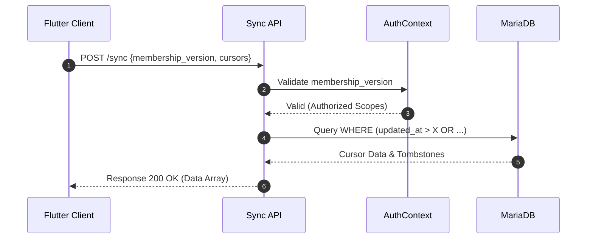
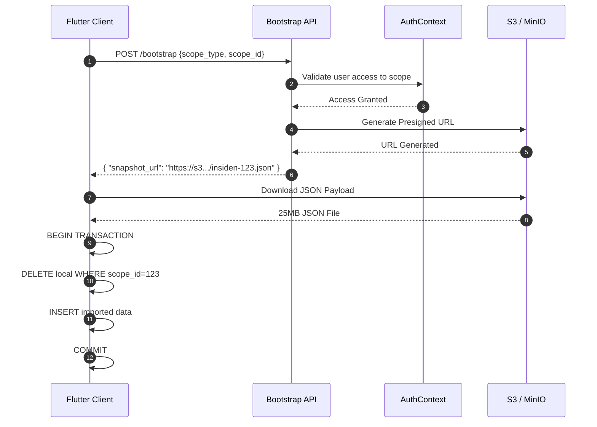
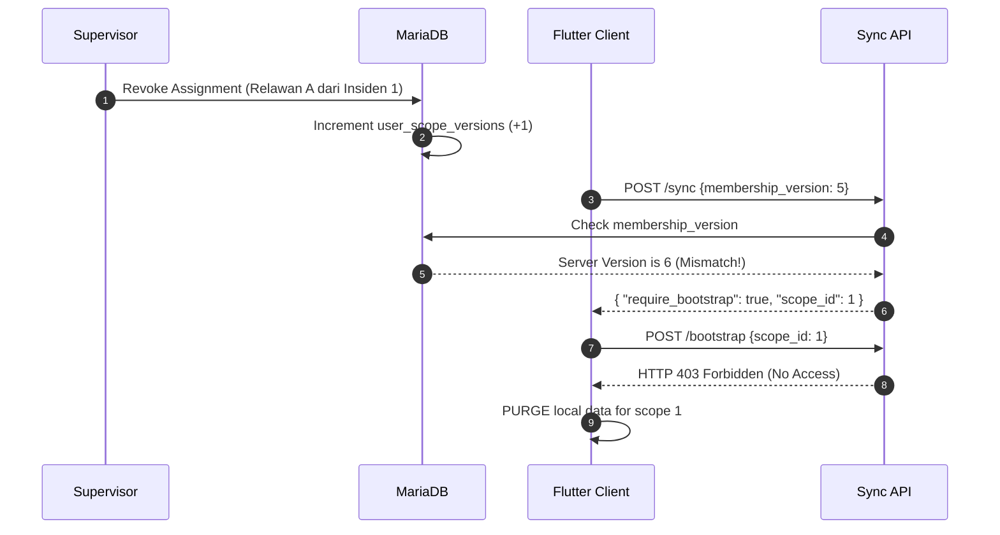

# RFC-001: OFFLINE SYNC ARCHITECTURE V1
**Status:** FROZEN (Baseline Architecture Approved)
**Author:** Technical Lead / Principal Architect
**Date:** 2026-06-17

## 1. Scope
Dokumen ini mendefinisikan arsitektur final, statis, dan mengikat untuk infrastruktur *Offline Sync* multi-tenant di platform NURISK. Standar ini mencakup mekanisme sinkronisasi data luring (Flutter), keamanan otorisasi dinamis, resolusi batas resolusi, penanganan konflik, serta mekanisme *bootstrap* awal. Arsitektur didasarkan pada **Option B++** dengan 4 lapisan mitigasi sistem terdistribusi.

## 2. Non-Goals
Untuk mencegah *over-engineering* dan menjaga *velocity* proyek, arsitektur ini secara eksplisit **TIDAK MENYELESAIKAN** dan **DILARANG** mengadopsi teknologi berikut:
- CQRS (Command Query Responsibility Segregation).
- Event Sourcing (Penyimpanan state berbasis *append-only log* absolut).
- CDC (Change Data Capture) via Debezium / Kafka.
- Device Queue Fan-out Table.
- Otomatisasi *Three-Way Merge* (OT/CRDT) di klien.

---

## 3. Core Mitigations (The 4 Fixes)

### FIX-1: Cursor Hole Mitigation (Deterministic Cursor)
Meninggalkan kursor berbasis *auto-increment* sekuensial yang rawan *Phantom Reads*. Kursor sinkronisasi wajib diubah menjadi pasangan (*tuple*) waktu dan ID: `(updated_at, id)`.
**Query Implementation:**
```sql
SELECT * FROM sync_cursors 
WHERE scope_type = ? AND scope_id = ?
AND (
    updated_at > ?
    OR (updated_at = ? AND id > ?)
)
ORDER BY updated_at ASC, id ASC
LIMIT 1000;
```

### FIX-2: Bootstrap Storm Mitigation (Object Storage)
Endpoint `POST /bootstrap` **dilarang** melakukan *query* dan *render JSON* secara *on-the-fly* ke MariaDB/MySQL. 
Sistem wajib me-*render* snapshot secara periodik/event-driven ke Object Storage (S3/MinIO). Klien hanya menerima *Presigned URL*.
*   Path S3: `nurisk-snapshots/insiden/{id}/latest.json`

### FIX-3: Offline Conflict Handling (Conflict Queue)
Sistem **dilarang** membalas dengan HTTP 409 (Conflict) murni yang berakibat klien membuang data luring.
Jika versi lokal `<` versi server, server memindahkan *payload* tersebut ke tabel `conflict_queues`.
Data berstatus konflik akan masuk ke *Dashboard Admin* untuk diselesaikan (*Manual Merge*) oleh Supervisor wilayah.

### FIX-4: Mandatory Bootstrap Purge (Zero Ghost Data)
Aplikasi Flutter terikat kontrak ketat untuk melakukan rotasi tabel via transaksi SQLite setiap kali memuat data Bootstrap.
**Wajib dieksekusi di SQLite:**
```sql
BEGIN TRANSACTION;
DELETE FROM sitreps WHERE scope_type = 'insiden' AND scope_id = 123;
DELETE FROM assessments WHERE scope_type = 'insiden' AND scope_id = 123;
-- [INSERT NEW BOOTSTRAP DATA] --
COMMIT;
```

---

## 4. Sequence Diagrams

### 4.1. Normal Sync Flow


### 4.2. Bootstrap Flow (Assignment Baru)


### 4.3. Revocation Flow (Pencabutan Akses)


---

## 5. Implementation Roadmap (Sprint Plan)

### Phase 0: Proof of Concept & Load Test (WAJIB SEBELUM KODE PRODUKSI)
*   Buat repositori mini `nurisk-sync-poc`.
*   Tabel *dummy*: `sync_cursors`, `user_scope_versions`, `sync_tombstones`.
*   Skrip K6 Load Test:
    1. **10.000 Request/sec** ke `POST /sync`
    2. **5.000 Request/sec** ke `POST /bootstrap`
    3. Eksekusi query dengan 1 Juta row *dummy cursor*.
    4. Simulasi *offline* 365 hari (pengecekan resolusi konflik).

### Sprint 1: Database Migration
*   Tambah `scope_type`, `scope_id`, dan *Composite Index*.
*   Ubah kursor menjadi sistem `updated_at`.

### Sprint 2: Observer Integration
*   Implementasi `SyncObserver` untuk penulisan log transaksional sinkronisasi luring.
*   Implementasi `AssignmentObserver` untuk mengelola `user_scope_versions`.

### Sprint 3: Authorization & Routing Layer
*   Hubungkan *Controller* Sync dengan `AuthorizationContextService`.

### Sprint 4: Bootstrap & S3 Worker
*   Bangun sinkronisasi *background* merender Snapshot Insiden JSON ke S3.
*   Bangun API Bootstrap pemberi *Presigned URL*.

### Sprint 5: Flutter Offline Engine
*   Implementasi logika SQLite Mandatory Purge.
*   Implementasi respons `require_bootstrap` dan resolusi S3 File Download.

### Sprint 6: Final QA & Production Load Test
*   Jalankan seluruh skenario integrasi dengan UI sebelum rilis *mobilisasi*.
