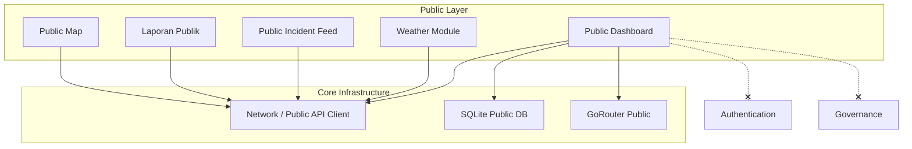

# NURISK MOBILE — PUBLIC DOMAIN ARCHITECTURE
## Document 16: Public Domain Foundation (Sprint F1)
**Version**: 1.0.0 | **Status**: APPROVED FOR SPRINT F1 | **Domain**: Public Layer  
**Author**: Enterprise Mobile Solution Architect

---

## 1. CONTEXT & OBJECTIVE

Paradigma aplikasi NURISK Mobile telah bertransisi menjadi **Public First**. Aplikasi dapat diakses sepenuhnya oleh masyarakat (guest) tanpa proses otentikasi. Login hanya diperlukan ketika pengguna ingin mengakses fitur Governance atau operasional (Relawan).

**Objective Sprint F1**: Membangun **Public Domain** sebagai fondasi mandiri (mini-application) yang production-ready. Public Domain harus memiliki routing, state management, repository, cache, dan lifecyclenya sendiri, sama sekali terisolasi dari Authentication dan Governance.

---

## 2. BOUNDARY & RESPONSIBILITIES

### Boundary
Public Layer **TIDAK BOLEH** memiliki *dependency* pada:
- `features/authentication/*`
- `features/governance/*`
- `features/operasi/*` (kecuali DTO publik)
- `shared/auth/*`
- Context token, session, atau role pengguna.

### Responsibilities
- Menginisialisasi aplikasi dan meload public cache
- Merender Splash Screen dan melakukan routing awal ke Public Dashboard
- Menampilkan data cuaca, peringatan dini, insiden terbaru, dan KPI publik
- Menangani form laporan masyarakat publik
- Mengelola state offline publik secara persisten

---

## 3. DEPENDENCY GRAPH & LAYER AUDIT



> **🔴 ARCHITECTURE VIOLATION RULE**: Jika ada import atau referensi dari package `public` menuju `auth` atau `governance`, build CI/CD harus digagalkan (linter rules).

---

## 4. BACKEND API AUDIT

Endpoint backend dikelompokkan untuk memastikan Public Layer hanya menggunakan Public API tanpa interceptor token Sanctum.

### PUBLIC ENDPOINTS (Digunakan oleh Sprint F1)
- `GET /api/public/dashboard`
- `GET /api/public/incident/{id}/detail`
- `GET /api/laporan/peta`
- `POST /api/laporan`
- `GET /api/weather/forecast`
- `GET /api/external/bmkg/gempa`
- `GET /api/internal/weather/*`
- `GET /api/wilayah/*`

### PROTECTED / INTERNAL (TIDAK BOLEH DIGUNAKAN DI F1)
- `GET /api/auth/me`
- `POST /api/auth/login`
- `GET /api/governance/*`
- `GET /api/v1/*` (kecuali jika ada proxy publik)

---

## 5. PACKAGE STRUCTURE

```
lib/
├── features/
│   └── public/
│       ├── data/
│       │   ├── datasources/
│       │   │   ├── public_remote_datasource.dart
│       │   │   └── public_local_datasource.dart
│       │   ├── models/
│       │   └── repositories/
│       │       ├── weather_repository_impl.dart
│       │       ├── dashboard_repository_impl.dart
│       │       └── incident_repository_impl.dart
│       ├── domain/
│       │   ├── entities/
│       │   └── repositories/
│       │       ├── weather_repository.dart
│       │       ├── dashboard_repository.dart
│       │       └── incident_repository.dart
│       └── presentation/
│           ├── controllers/
│           │   ├── weather_state.dart
│           │   └── dashboard_state.dart
│           ├── widgets/
│           │   ├── weather_card.dart
│           │   ├── warning_banner.dart
│           │   └── kpi_cards.dart
│           └── screens/
│               ├── public_dashboard_screen.dart
│               ├── public_map_screen.dart
│               └── public_report_screen.dart
```

---

## 6. WIDGET AUDIT (DASHBOARD PUBLIC)

Dashboard publik dipecah menjadi widget independen dengan Single Responsibility Principle (SRP).

| Widget | Responsibility | State Provider | Cache Strategy | Skeleton |
|--------|----------------|----------------|----------------|----------|
| **WeatherCard** | Menampilkan cuaca lokasi saat ini | `weatherStateProvider` | 15 menit | Shimmer cloud |
| **WarningBanner** | Menampilkan peringatan BMKG/EWS | `warningStateProvider` | 30 detik | Hidden jika null |
| **KPICards** | Menampilkan total relawan, laporan | `dashboardStateProvider` | 2 menit | Shimmer box |
| **LatestIncident**| Menampilkan feed insiden terbaru | `incidentStateProvider` | 2 menit | Shimmer list |
| **QuickAction** | Tombol navigasi (Lapor, Donasi, dll) | Statis (Routing) | N/A | N/A |
| **DonationCard**| Menampilkan link lazisnu | `donationStateProvider` | 24 jam | Shimmer image |
| **NewsCard** | Menampilkan artikel/berita | `newsStateProvider` | 30 menit | Shimmer list |
| **MapPreview** | Mini map lokasi kejadian | `mapStateProvider` | 5 menit | Blank map |

**Aturan Penanganan Gagal (Failure Strategy)**:
Setiap widget menangkap error secara independen. Jika `WeatherCard` gagal (karena timeout API eksternal), `LatestIncident` dan widget lain tetap berjalan. Tampilkan widget `ErrorRetryCard` khusus untuk section yang gagal.

---

## 7. STATE MANAGEMENT

State dipecah menjadi provider spesifik. Tidak ada satu "God Object" atau BLoC tunggal.

```dart
// Riverpod Annotations
@Riverpod(keepAlive: true)
class WeatherState extends _$WeatherState { ... }

@Riverpod(keepAlive: true)
class DashboardState extends _$DashboardState { ... }

@Riverpod(keepAlive: true)
class IncidentState extends _$IncidentState { ... }

@Riverpod(keepAlive: true)
class WarningState extends _$WarningState { ... }
```
**Catatan Penting**: Semua Public State menggunakan `keepAlive: true` sehingga state ini tetap berjalan persisten walau pengguna keluar-masuk login.

---

## 8. REPOSITORY LAYER

Desain repository independen. Tidak boleh ada cross-dependency antar repository.

- `WeatherRepository`: Khusus integrasi dengan API BMKG dan Internal Weather.
- `DashboardRepository`: Khusus fetching KPI dan metadata agregat.
- `IncidentRepository`: Khusus daftar insiden (read-only publik).
- `NewsRepository`: Khusus artikel CMS.

---

## 9. CACHING POLICY (STALE-WHILE-REVALIDATE)

| Module | API Refresh | Local Cache | Offline Capability |
|--------|------------|-------------|--------------------|
| Weather | 15 menit | 15 menit | ✅ Ya (Tampilkan data terakhir) |
| Dashboard KPI | 1 menit | 2 menit | ✅ Ya |
| Warning (EWS) | 30 detik | 30 detik | ✅ Ya |
| Latest Incident | 1 menit | 2 menit | ✅ Ya |
| News/Berita | 10 menit | 30 menit | ✅ Ya |

**Cache Storage**: Menggunakan SQLite `public_db` atau `Hive`/`Isar`. Cache ini **TIDAK PERNAH DIHAPUS** pada saat user melakukan aksi "Logout", karena Public Layer adalah state global.

---

## 10. PERFORMANCE BUDGET

Tuntutan kinerja Public Layer sangat tinggi karena melayani end-user masyarakat.

- **Cold Start**: < 2 detik (hingga Dashboard ter-render)
- **First Paint Dashboard**: < 1 detik (Skeleton/Cache render)
- **Image Loading**: Wajib menggunakan `cached_network_image` dengan resolusi thumbnail
- **Lazy Load**: Widget di luar viewport (News, MapPreview) menggunakan lazy load (Sliver)
- **Concurrency**: Fetch API dilakukan paralel ( `Future.wait` )
- **Blocking**: TIDAK BOLEH ada spinner full-screen yang memblokir interaksi user.

---

## 11. NAVIGATION & ROUTING

Navigasi publik terisolasi dan hanya memiliki 5 rute dasar:

```
App Router
  └── Public Shell
        ├── /p/home      (Dashboard)
        ├── /p/map       (Peta Insiden)
        ├── /p/report    (Form Laporan)
        ├── /p/resource  (Informasi Posko/RS)
        └── /p/profile   (Guest Profile / Login Action)
```
Tombol "Login" bukan merupakan root rute. Ia adalah *Action* di dalam tab `/p/profile` atau dipicu saat mengakses route `/g/*` yang dilindungi.

---

## 12. DEFINITION OF DONE (DoD) SPRINT F1

Sprint F1 dinyatakan selesai apabila kriteria berikut terpenuhi:
1. Public Domain berjalan penuh tanpa otentikasi (tanpa error token).
2. Seluruh API request menggunakan endpoint `/api/public/` atau `/api/weather/`.
3. Arsitektur membuktikan tidak ada dependensi terhadap package `auth` atau `governance`.
4. Dashboard Publik menampilkan 10 widget independen dengan Skeleton loading, Error state mandiri, dan fitur Retry per-widget.
5. Mode Offline berfungsi: saat internet dimatikan, aplikasi tetap menampilkan cache data terakhir.
6. Target Performance tercapai (Cold start < 2 detik).
7. Transisi UI ke arah halaman login (sebagai *Action*, bukan default) telah berfungsi.

---

## 13. ATOMIC SPRINT BACKLOG (EPIC F1)

Gunakan backlog ini di Jira/Tracker:

- [ ] **F1.1 Application Shell & Initialization**: Setup GoRouter public shell dan provider utama.
- [ ] **F1.2 Public Network Client**: Setup Dio client tanpa auth interceptor.
- [ ] **F1.3 SQLite Public Database**: Setup struktur tabel drift untuk public cache.
- [ ] **F1.4 Bottom Navigation**: Implement UI public nav bar.
- [ ] **F1.5 Weather Module**: Repository, State, & UI Weather Card.
- [ ] **F1.6 Warning Banner**: Polling mechanism EWS & UI.
- [ ] **F1.7 KPI Cards**: Data aggregation & UI display.
- [ ] **F1.8 Latest Incident Feed**: Pagination list & UI cards.
- [ ] **F1.9 Quick Actions**: Grid menu navigation.
- [ ] **F1.10 Public Profile Screen**: Tampilan Guest dengan CTA Login.
- [ ] **F1.11 Caching Interceptor**: Implement stale-while-revalidate pattern.
- [ ] **F1.12 Error Handling Widgets**: Buat komponen `ErrorRetryCard` dan `OfflineBanner`.
- [ ] **F1.13 Performance Audit**: Pengujian cold start dan frame rate (60fps).
- [ ] **F1.14 Accessibility (a11y)**: Text scaling dan semantik pembaca layar.

---
*Document end.*
